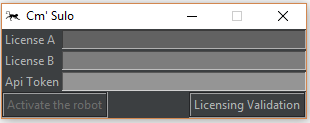
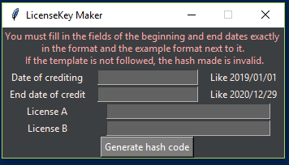

# CM Sulo Bot
May monitoring software is run by telegram robot

With this robot, you can monitor and control your system remotely with minimal features
The robot's mode of operation is that it listens to messages received by connecting to telegram servers and responds to commands.
The software is designed to be your entertainment as a license to your friends

