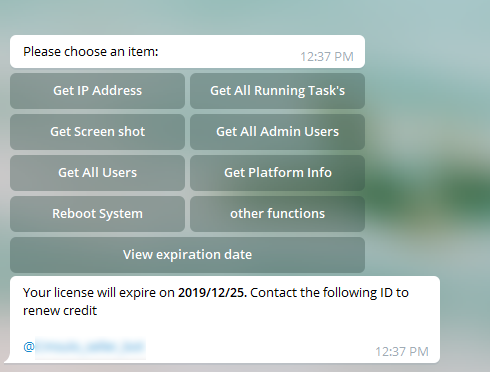

# CM Sulo Bot
May monitoring software is run by telegram robot

With this robot, you can monitor and control your system remotely with minimal features
The robot's mode of operation is that it listens to messages received by connecting to telegram servers and responds to commands.
The software is designed to be your entertainment as a license to your friends  

Robot capabilities:
 

1- Get public and private public IP addresses 
2- Get a list of running programs along with PID 
3- Get screen shot at the moment of the server 
4- Get list of users who have admin access 
5- Get list of users with normal access 
6- Get hardware specifications for the server 
7- Ability to restart the server 
8- Ability to download the file on the server and send it to you 
9- Ability to open and execute file types on a remote server 
10- Ability to send the file to the robot and save to the server 
11- File deletion ability 
12- Ability to copy the file 
13- File transferability 
14- Most importantly, the ability to run cmd commands with the robot  

 

<b>Examples Command:</b> 
<b>get:</b>    [download file like > get:c:\text.txt] 
<b>cmd:</b>    [run cmd script like > cmd:dir c:\] 
<b>open:</b>   [open the file like > open:c:\sample.exe] 
<b>delete:</b> [delete file like > delete:c:\netbook.txt] 
<b>copy:</b>   [copy file like > copy:c:\a.txt->c:\windows\a.txt] 
<b>move:</b>   [move file like > move:c:\a.txt->d:\a.txt] 

